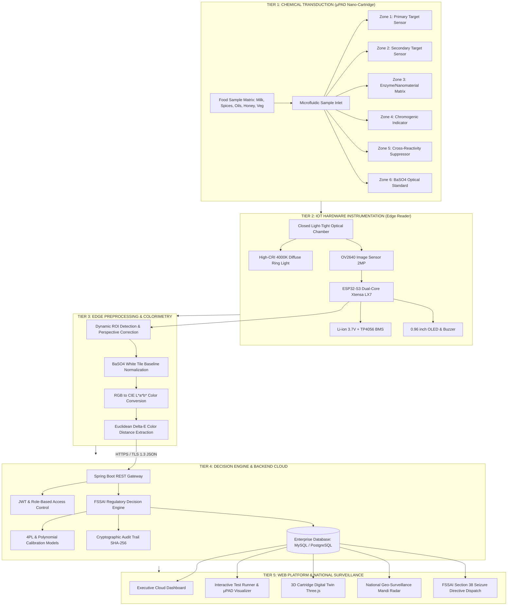

# 🏛️ NanoKhadya™ System Architecture Blueprint
**Smart India Hackathon (SIH) | Problem Statement ID: 26235**  
**Ministry of Food Processing Industries (MoFPI)**  
*Project Title: Development of a Portable Nano-engineered Rapid Food Testing Kit for On-Site Detection of Food Adulterants and Contaminants*

---

## 1. High-Level Architecture Diagram



---

## 2. Layer-by-Layer Architectural Breakdown

### Layer 1: Transduction & Microfluidic Cartridge (μPAD)
* **Substrate**: Grade 1 Whatman filter paper patterned via wax-printing photolithography creating hydrophobic barriers and 6 discrete hydrophilic reaction reservoirs.
* **Transduction Mechanisms**:
  1. **Plasmonic Resonance (LSPR)**: 13 nm Citrate-capped Gold Nanoparticles (AuNPs) experiencing localized surface plasmon resonance red-shift ($520\text{ nm} \to 650\text{ nm}$) upon analyte-induced crosslinking (Melamine).
  2. **Nanozyme Catalytic Oxidation**: $\text{Fe}_3\text{O}_4$ magnetic nanoparticles mimicking natural peroxidase to catalyze TMB oxidation in presence of peroxides ($H_2O_2$).
  3. **Enzymatic Chromogenesis**: Immobilized Urease converting urea to $\text{NH}_4^+$ in presence of phenol red indicator.
  4. **Inclusion Complexation**: Lugol's polyiodide ($I_3^-$) forming helical inclusion complexes within amylose polysaccharide spirals (Starch & Dextrin).
  5. **Specific Diazotization & Color Reactions**: Acid-promoted quinoid transformations (Metanil Yellow in turmeric, Baudouin test for Vanaspati in Ghee, Fiehe's test for inverted HMF sugars in honey).

---

### Layer 2: Embedded Reader Hardware (Edge IoT)
```
+-------------------------------------------------------------------------+
|                  PORTABLE NANO-READER CHAMBER (ABS-FR)                  |
|                                                                         |
|   +-----------------------------------------------------------------+   |
|   |                  CEILING: Optical Lighting Subsystem            |   |
|   |       [High-CRI LED]      [OV2640 Lens]      [High-CRI LED]     |   |
|   |       Diffuser Baffle       Aperture         Diffuser Baffle    |   |
|   +-----------------------------------------------------------------+   |
|                                   |  Optical Path (28 mm)               |
|                                   v                                     |
|   +-----------------------------------------------------------------+   |
|   |         SLIDING DRAWER: Microfluidic Test Cartridge (μPAD)      |   |
|   |     (Z1: Analyte 1)  (Z2: Analyte 2)  (Z3: Analyte 3)           |   |
|   |     (Z4: Analyte 4)  (Z5: Analyte 5)  (Z6: BaSO4 Ref White)     |   |
|   +-----------------------------------------------------------------+   |
|                                                                         |
|   +-----------------------------------------------------------------+   |
|   |                   ELECTRONIC CONTROLLER BASE                    |   |
|   |    [ ESP32-S3 MCU ]  [ 3.7V Li-ion Battery ]  [ TP4056 BMS ]    |   |
|   |    [ 0.96" OLED   ]  [ Piezo Buzzer        ]  [ Wi-Fi / LTE]    |   |
|   +-----------------------------------------------------------------+   |
+-------------------------------------------------------------------------+
```

---

### Layer 3: Edge Colorimetry & Computer Vision Pipeline
1. **Geometric Alignment**: Automatic extraction of cartridge outer fiducial bounding box.
2. **Standard Calibration**: Normalization of illumination using Zone 6 ($BaSO_4$ white reference tile):
   $$R_{norm} = \frac{R_{sample}}{R_{ref}} \times 255, \quad G_{norm} = \frac{G_{sample}}{G_{ref}} \times 255, \quad B_{norm} = \frac{B_{sample}}{B_{ref}} \times 255$$
3. **CIE $L^*a^*b^*$ Transformation**: Converts device-dependent RGB into perceptually uniform CIE $L^*a^*b^*$ color space.
4. **Euclidean Color Difference Calculation**:
   $$\Delta E = \sqrt{(L_{test}^* - L_{blank}^*)^2 + (a_{test}^* - a_{blank}^*)^2 + (b_{test}^* - b_{blank}^*)^2}$$

---

### Layer 4: Cloud Decision Engine & Regulatory Matrix (Backend)
* **Framework**: Spring Boot 3.3.4 with Java 21 LTS.
* **Decision Rules Engine (`DecisionEngineService.java`)**:
  - **4-Parameter Logistic (4PL) Curves** mapping $\Delta E$ directly to ppm / % w/w concentrations.
  - **Regulatory Enforcement**: Compares concentrations directly against **FSSAI Food Safety and Standards (Contaminants, Toxins and Residues) Regulations**.
  - **Validity Gate**: Enforces cartridge expiration date verification and optical saturation boundary checks.
* **Security**: JWT Authentication (HMAC-SHA512) with role-based segregation (`FIELD_OFFICER`, `LAB_ANALYST`, `ADMIN_DIRECTOR`).
* **Audit Trail**: Every record is hashed with SHA-256 and tied to GPS coordinates, device UID, and timestamp.

---

### Layer 5: Web Platform & Geo-Surveillance Frontend
* **Frontend Core**: React 19, TypeScript, Vite.
* **Responsive Styling**: Pure Vanilla CSS design tokens with adaptive mobile viewport flow (`0 overlap`).
* **Visual Computing Engines**:
  - **Three.js WebGL Engine**: Interactive 3D Digital Twin with exploded layer views and ray-traced lighting.
  - **3D LSPR Surface Plotter**: Mathematical visualization of gold nanoparticle localized surface plasmon resonance.
* **National Food Safety Radar (`NationalGeoMapView.tsx`)**:
  - Live spatial vector tracking across 12 major Indian wholesale APMC mandis.
  - 360° rotating radar sweep and real-time incident feed.
  - Automatic FSSAI Section 38 Seizure Directive generation.
